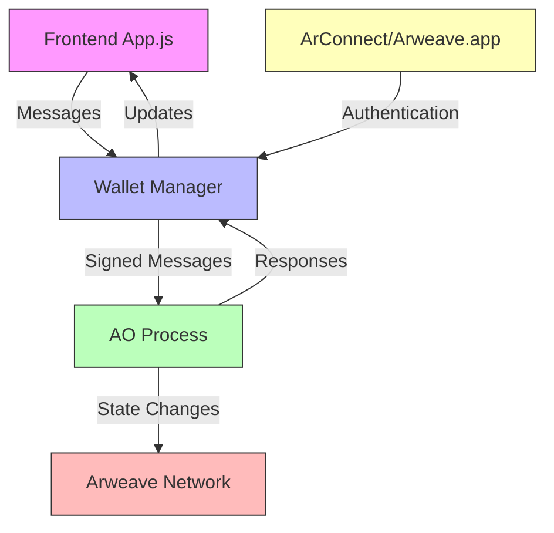
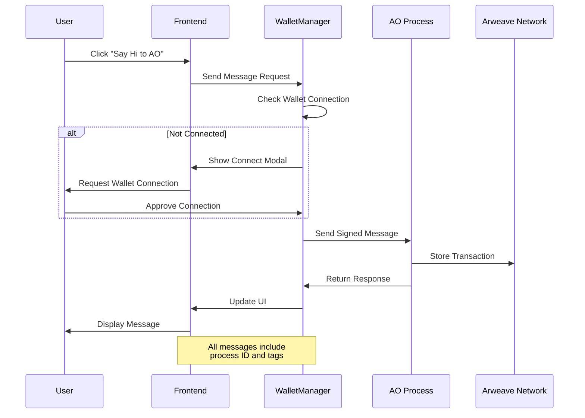

# Minimal AO

A lightweight decentralized application demonstrating communication between a web frontend and AO processes on the Arweave blockchain.

## Tech Stack

**Frontend**  
- Vanilla JavaScript with Web Components
- HTML5 Canvas for Matrix-style animations
- Arweave wallet integration (ArConnect/Arweave.app)

**Backend**  
- AO Protocol for smart contract execution
- Lua-based process handlers
- Arweave blockchain for permanent storage

## Architecture Overview

The application follows a decentralized architecture where the frontend communicates directly with AO processes on the Arweave blockchain:



### Key Components

1. **Frontend (app.js)**
   - Handles UI rendering and user interactions
   - Manages the Hexocet animation background
   - Processes wallet connections and message display

2. **Wallet Manager (WalletManager.js)**
   - Manages wallet connections (ArConnect/Arweave.app)
   - Handles message signing and AO communication
   - Provides wallet state management

3. **AO Process (ao/ao.lua)**
   - Processes incoming messages
   - Executes business logic
   - Manages state on the Arweave blockchain

## Communication Flow

The following diagram illustrates the message flow for a typical interaction:



1. **Message Sending**
```javascript
// Frontend initiates message
const tags = [
    { name: 'Action', value: 'Greeting' },
    { name: 'App-Name', value: 'Permaweb-App' }
];
const response = await walletManager.sendMessageToAO(tags, data, processId);
```

2. **Process Handling**
```lua
-- AO Process receives and processes message
Handlers.add('Greeting',
  Handlers.utils.hasMatchingTag('Action', 'Greeting'),
  function(msg)
    -- Process message and send response
  end
)
```

## Setup and Installation

1. **Install Dependencies**
```bash
bun install
```

2. **Environment Setup**
- Install ArConnect browser extension or use Arweave.app
- Configure AO Process ID in your environment

3. **Run Development Server**
```bash
bun run dev
```

## Key Features

### Wallet Integration
- Supports multiple wallet providers
- Secure message signing
- Connection state management

### UI Components
- Interactive message display
- Real-time animation effects
- Responsive design

### AO Integration
- Direct process communication
- Message verification
- Transaction permanence

## Security Considerations

1. **Wallet Security**
   - Automatic disconnection handling
   - Secure key management via wallet providers
   - Transaction signing verification

2. **Message Security**
   - Signed transactions
   - Verified process communication
   - Error handling and validation

## Development

### Project Structure
```
minimal-ao/
├── src/
│   ├── app.js              # Main application entry
│   ├── animation/          # Canvas animations
│   └── wallet/             # Wallet management
├── ao/
│   └── ao.lua             # AO process handlers
└── public/
    └── fonts/             # Custom fonts
```

### Building
```bash
bun run build
```

### Testing
```bash
bun test
```

## Contributing

1. Fork the repository
2. Create a feature branch
3. Submit a pull request

## License

This project is licensed under the MIT License - see the LICENSE file for details.

## Resources

- [AO Protocol Documentation](https://ao.link)
- [Arweave Development](https://docs.arweave.org)
- [Permaweb Resources](https://arweave.net)
