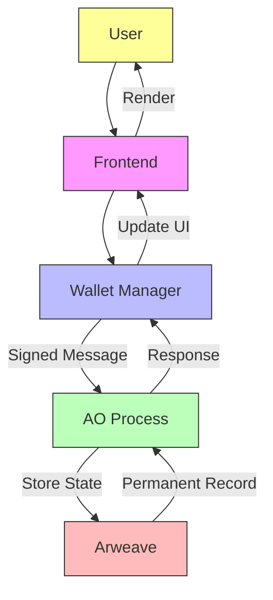
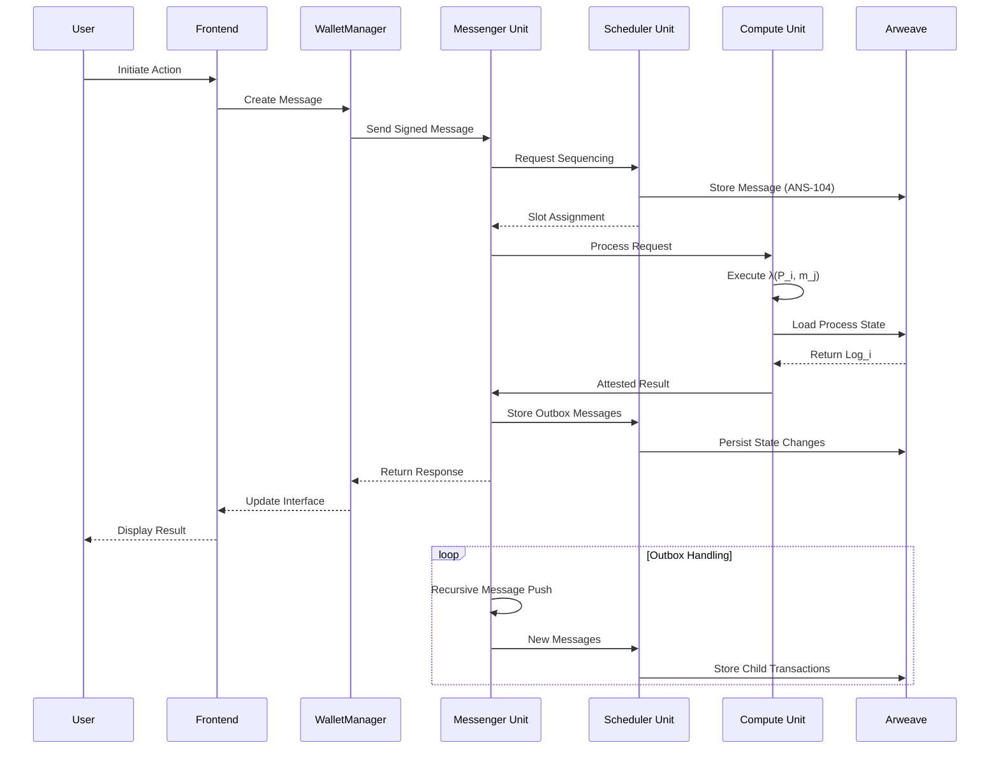
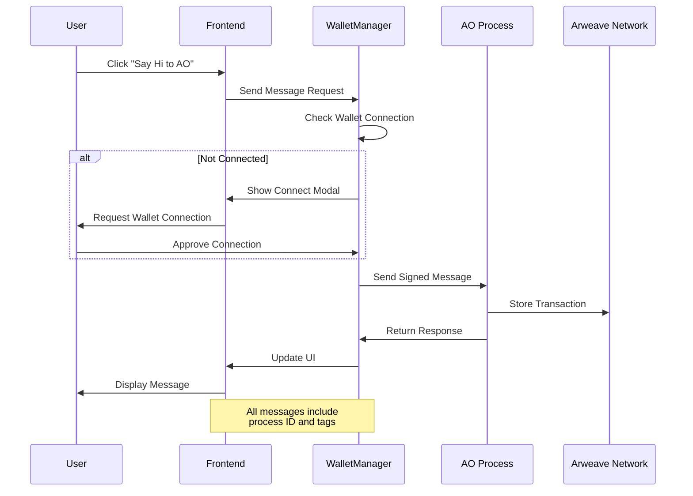

# Minimal Permaweb

A lightweight decentralized application demonstrating communication between a web frontend and AO processes on the Arweave blockchain.

## Tech Stack

**Frontend**  
- Vanilla JavaScript with Web Components
- HTML5 Canvas for Matrix-style animations
- Arweave wallet integration (ArConnect/Arweave.app)

**Backend**  
- AO Protocol for smart contract execution
- Lua-based process handlers
- Arweave blockchain for permanent storage

## Architecture Overview

AO's architecture is presented in two perspectives: a minimal flow for basic understanding and an advanced flow showing the complete system architecture.

### Minimal AO Architecture



**Key Components:**
1. **Frontend**: Handles user interactions and UI rendering
2. **Wallet Manager**: Manages cryptographic signatures and message formatting
3. **AO Process**: Lua VM executing contract logic (state transitions)
4. **Arweave**: Permanent storage for process logs and messages

### Advanced AO Network Flow



**Component Roles:**

| Unit | Responsibility | Key Reference |
|------|----------------|---------------|
| **MU** | Message routing & push mechanics | Message Units |
| **SU** | Atomic slot assignment & persistence | Scheduler Units |
| **CU** | State computation & attestation | Compute Units |
| **Arweave** | Immutable log storage | Storage Layer |

**Enhanced Flow Details:**
1. **Message Sequencing**: SUs assign globally ordered slots using Merkle proofs
2. **Holographic State**: CUs compute state from Arweave-stored logs using VM λ
3. **Attestation Chains**: Signed results include CU stake commitments
4. **Recursive Processing**: MU handles outbox messages as new transactions

### Security Considerations
- Economic security via stake slashing
- Sybil resistance through consensus mechanisms
- Holographic state verification
- Cryptographic message signing

### Key Innovations
- Parallel process execution
- Unbounded compute capabilities
- Modular VM architecture
- Web2-like development experience with Web3 security

## Communication Flow

The following diagram illustrates the message flow for a typical interaction:



1. **Message Sending**
```javascript
// Frontend initiates message
const tags = [
    { name: 'Action', value: 'Greeting' },
    { name: 'App-Name', value: 'Permaweb-App' }
];
const response = await walletManager.sendMessageToAO(tags, data, processId);

async sendMessageToAO(tags, data = "", processId) {
    if (!this.signer) {
      throw new Error("Signer is not initialized. Please connect wallet first.");
    }

    try {
      console.log("Message sent to AO:", {
        ProcessId: processId,
        Tags: tags,
        Signer: this.signer
      });

      const messageId = await message({
        process: processId,
        tags,
        signer: this.signer,
        data: data,
      });

      console.log("Message ID:", messageId);
      
      // For read-only operations, use dryrun
      if (tags.some(tag => tag.name === "Action" && tag.value === "Read")) {
        const { Messages, Error } = await dryrun({
          process: processId,
          tags: tags,
          data: data,
          signer: this.signer,
        });
        
        if (Error) {
          console.error("Error in dry run:", Error);
          throw new Error(Error);
        }
        
        return { Messages, Error, messageId };
      }

      // For write operations, use result
      const resultsOut = await result({
        process: processId,
        message: messageId,
        data: data,
      });
      
      console.log("Results:", resultsOut);

      const { Messages, Error } = resultsOut;

      if (Error) {
        console.error("Error in AO response:", Error);
        throw new Error(Error);
      }

      console.log("Messages:", Messages);
      console.log("AO action completed successfully");

      return { Messages, Error, messageId };
    } catch (error) {
      console.error("Error sending message to AO:", error);
      throw error;
    }
  }
```

2. **Process Handling**
```lua
-- AO Process receives and processes message
local json = require("json")

Handlers.add(
  "Greeting",
  Handlers.utils.hasMatchingTag("Action", "Greeting"),
  function (msg)
    local sender = msg.From
    local timestamp = os.time()
    local greeting = "Hello from AO!"
    
    local response = {
      from = sender,
      timestamp = timestamp,
      greeting = greeting
    }
    
    Handlers.utils.reply(msg, json.encode(response))
  end
)

```

## Setup and Installation

1. **Install Dependencies**
```bash
bun install
```

2. **Environment Setup**
- Install ArConnect browser extension or use Arweave.app
- Configure AO Process ID in your environment

3. **Run Development Server**
```bash
bun run dev
```

## Key Features

### Wallet Integration
- Supports multiple wallet providers
- Secure message signing
- Connection state management

### UI Components
- Interactive message display
- Real-time animation effects
- Responsive design

### AO Integration
- Direct process communication
- Message verification
- Transaction permanence

## Security Considerations

1. **Wallet Security**
   - Automatic disconnection handling
   - Secure key management via wallet providers
   - Transaction signing verification

2. **Message Security**
   - Signed transactions
   - Verified process communication
   - Error handling and validation

## Development

### Project Structure
```
minimal-ao/
├── src/
│   ├── app.js              # Main application entry
│   ├── animation/          # Canvas animations
│   └── wallet/             # Wallet management
├── ao/
│   └── ao.lua             # AO process handlers
└── public/
    └── fonts/             # Custom fonts
```

### Building
```bash
bun run build
```

### Testing
```bash
bun test
```

## Contributing

1. Fork the repository
2. Create a feature branch
3. Submit a pull request

## License

This project is licensed under the MIT License - see the LICENSE file for details.

## Resources

- [AO Protocol Documentation](https://cookbook_ao.ar.io)
- [Arweave Development](https://docs.arweave.org](https://cookbook.arweave.dev/)
- [Permaweb Resources](https://arweavehub.com/discover)
